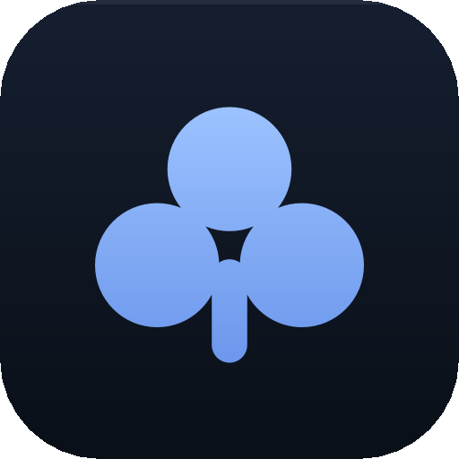
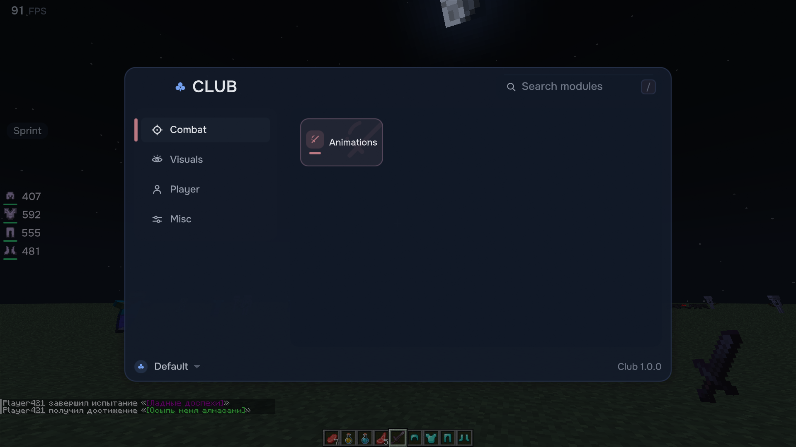
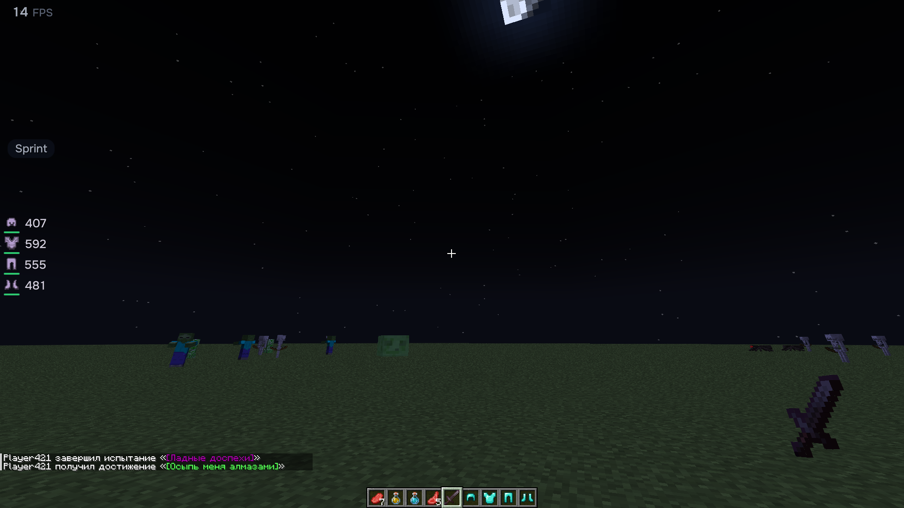
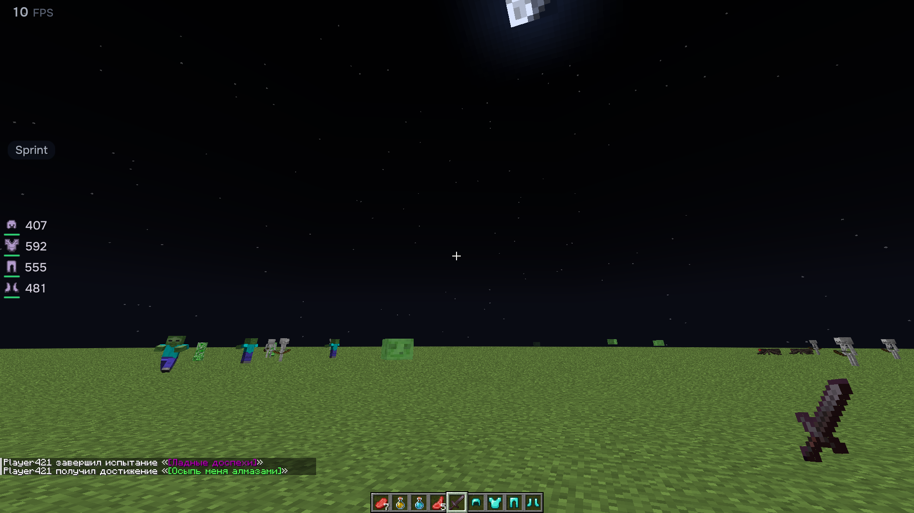
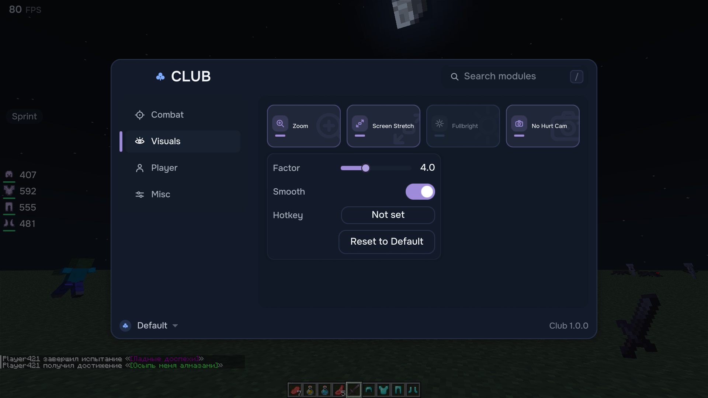
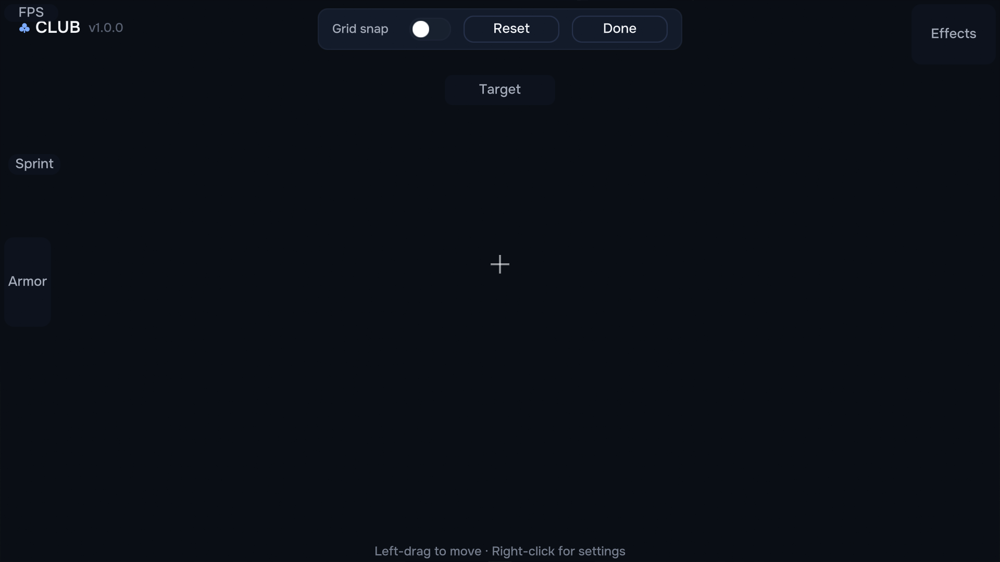

# Club

A clean, **flat** first-person utility client for Minecraft (Fabric **1.21.1**, **1.21.8** and **1.21.11**).
Zoom, fullbright, freelook, item scrolling, a movable HUD, custom hands & attack animations, and per-module
hotkeys — all behind one calm menu. No glass, no glow, no clutter.

Open the menu with **Right Shift**.

[](https://modrinth.com/mod/clubclient)
[](https://discord.gg/kq2DYuTQnW)
[](https://github.com/ClubClient/clubclient/actions/workflows/build.yml)
[](LICENSE)



## Club is not a cheat client

No killaura, no ESP, no reach, no autoclicker, no X-ray, no combat automation. Nothing in Club gives you
information the game doesn't, or reach the game doesn't. Everything it does is about *your* view of the game
and *your* convenience at the keyboard — so it belongs on servers that ban hacks.

The source is right here; you don't have to take our word for it.

*One honest footnote, since you can read the code:* **Item Scrolling moves items by clicking slots** — the
same packets your own hand sends, just faster. The protocol has no batch move, so a strict anti-cheat may
rate-limit a large transfer the way it would rate-limit fast clicking. Nothing else in Club talks to the
server at all.

## Features

**Visuals**
- **Zoom** — hold to magnify the world; smooth eased FOV, scroll to adjust the amount (2×–8×). Your look
  sensitivity slows with the zoom, so the world crosses the screen at one speed at any magnification.
- **Fullbright** — see in the dark. Overrides only the world lightmap, so your real brightness slider and
  `options.txt` are never touched.
- **Screen Stretch** — fake a target aspect ratio (with optional letterbox bars).
- **No Hurt Cam / No Fire Overlay / No Bobbing** — a quieter first-person view.

**Player**
- **Hands** — reposition and scale the first-person hands, per hand.
- **Toggle Sprint** — sprint automatically, no key held; with a quiet on-screen indicator.
- **Freelook** — hold to swing the camera around yourself without turning. It never changes your aim or
  movement — a camera feature, not an aim tool.

**Combat**
- **Animations** — a custom first-person attack animation (Overhead / Spin / …), with speed & amplitude.

**Item Scrolling** — move items with the mouse instead of clicking them one at a time. Scroll a slot for one
item, **Shift** for the stack, **Ctrl** for every stack of that type, **Shift+drag** across slots to move each
one you cross. Every gesture is rebindable on its own screen; two actions can never share one; and if a
gesture overrides something vanilla already does with it, the row tells you instead of quietly eating the
click.

**Performance** — Club stops drawing what you cannot see. Minecraft doesn't cull particles at all, and it
frustum-culls the 16×16×16 section but never the chest inside it. Club skips both. Measured, interleaved in
one session on a fixed-seed scene: **−5.3%** frame time on a normal machine, **−8.1%** on a CPU-bound one.
Where the GPU is the bottleneck, our own benchmark refuses to claim a win — and prints that it refuses. Run
it yourself: `CLUB_BENCH=1 ./gradlew runClient`. The report we measured against is in
[docs/bench/](docs/bench/).

**HUD** — a movable, editor-driven overlay in one flat "chips" language: status effects, the crosshair
target's health, worn armor, an FPS whisper, and the sprint indicator. Drag to place, right-click for
per-element settings, snap to a grid, or nudge with the arrow keys. It's the size you set it — Minecraft's
GUI Scale doesn't touch it.

**Everything is keyboard-friendly**, and every toggleable module can be bound to its own **hotkey** from its
settings popover.

## Screenshots

| In-world HUD | Fullbright |
|---|---|
|  |  |

| Settings popover | HUD editor |
|---|---|
|  |  |

## Install

1. Install [Fabric Loader](https://fabricmc.net/use/) for **1.21.1**, **1.21.8** or **1.21.11**.
2. Download [Fabric API](https://modrinth.com/mod/fabric-api) for that same version and drop it in `mods/`.
3. Get Club from [Modrinth](https://modrinth.com/mod/clubclient) or
   [Releases](https://github.com/ClubClient/clubclient/releases) — **one jar per Minecraft version**, named
   for the one it is built against (`club-0.1.4+mc1.21.8.jar`). Drop it in `mods/`.
4. Launch. Press **Right Shift** to open the menu.

Each jar declares the single Minecraft version it was built for and will not load on another. That is
deliberate: a client that starts and then behaves strangely is worse than one that says you have the wrong
download.

**Requirements:** Minecraft 1.21.1 / 1.21.8 / 1.21.11 · Fabric Loader ≥ 0.15 · Fabric API · Java 21.
**Compatible with:** Sodium, Iris (shaderpacks included), Freecam — the gallery images were shot with all
three loaded at once.

## Default controls

| Action | Key |
|---|---|
| Open the Club menu | Right Shift |
| Zoom (hold) | C |
| Freelook (hold) | Left Alt |

Zoom and Freelook are rebindable in vanilla **Options → Controls → Club**. Any module can also be given a
toggle hotkey from its settings popover in the Club menu.

## Build from source

```bash
./gradlew build      # jar → build/libs/club-<version>.jar
./gradlew runClient  # launch a dev client
```

Java 21 and an internet connection (for the first dependency fetch) are required.

Club ships its own instruments, and they are not tests — they are separate programs that drive a real client:

```bash
CLUB_HARNESS=1 ./gradlew runClient --args="--quickPlaySingleplayer club-harness-world"  # 94 checks, 25 screenshots
CLUB_BENCH=1 ./gradlew runClient                                                        # ON/OFF interleaved, paired deltas
./gradlew runClient -PclubCompat -PclubIris                                             # Sodium + Iris + Freecam
```

See [CONTRIBUTING.md](CONTRIBUTING.md) before opening a pull request — there are six rules that will close
one, and each was bought with a bug.

## Help & bugs

- **A bug** → [open an issue](https://github.com/ClubClient/clubclient/issues/new/choose). Bring your mod list
  and `latest.log`; a conflict with the mods you already run is the usual answer.
- **Getting it set up** → [Discord](https://discord.gg/kq2DYuTQnW), `#support`.

## License

**MIT** — see [LICENSE](LICENSE).

The UI is set in [Onest](https://github.com/simpals/onest) by Dmitri Voloshin and Andrey Kudryavtsev, used
under the [SIL Open Font License 1.1](https://scripts.sil.org/OFL) — see
[THIRD-PARTY-NOTICES.md](THIRD-PARTY-NOTICES.md). The font files live in `tools/fonts/`; the jar carries a
pre-rendered MSDF atlas of them. Every icon is drawn for Club.
